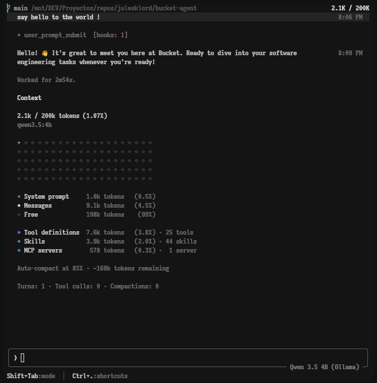
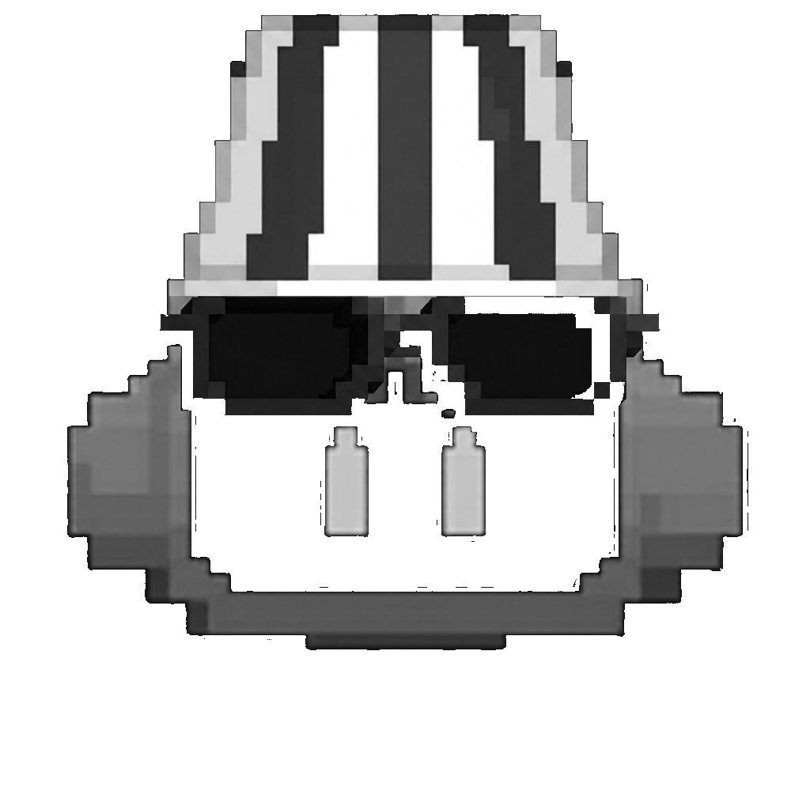

<div align="center">


<p>
  <a href="https://github.com/julesklord/bucket-agent/actions/workflows/ci.yml"></a>
  <a href="https://github.com/julesklord/bucket-agent/actions/workflows/rust.yml"></a>
  <a href="https://github.com/julesklord/bucket-agent/releases"></a>
  <a href="https://www.rust-lang.org"></a>
  <a href="LICENSE"></a>
  <a href="#quickstart-with-ollama"></a>
</p>

---




> What if you get a nice bucket, but it's full of junk? Toss the junk and keep that nice **bucket**.

# Bucket Agent (`bucket`)

**Bucket Agent** is an open, multiprovider terminal AI coding agent. It runs as a full-screen TUI that understands your codebase, edits files, executes shell commands, searches the web, and manages long-running tasks — interactively, headlessly for scripting/CI, or embedded in editors via the Agent Client Protocol (ACP).

No xAI account required. Use it with Ollama, OpenAI, Anthropic, or any OpenAI-compatible backend.

[Building from source](#building-from-source) ·
[Quickstart with Ollama](#quickstart-with-ollama) ·
[Documentation](#documentation) ·
[Repository layout](#repository-layout) ·
[Development](#development) ·
[Contributing](#contributing) ·
[License](#license)

</div>

---

## Building from source

Requirements:

- **Rust** — the toolchain is pinned by [`rust-toolchain.toml`](rust-toolchain.toml);
  `rustup` installs it automatically on first build.
- **[DotSlash](https://dotslash-cli.com)** — required so hermetic tools under
  [`bin/`](bin/) (notably [`bin/protoc`](bin/protoc)) can download and run.
  Install it and ensure `dotslash` is on your `PATH` **before** building:

  ```sh
  cargo install dotslash
  # or: prebuilt packages — https://dotslash-cli.com/docs/installation/
  /usr/bin/env dotslash --help   # sanity check
  ```

- **protoc** — proto codegen resolves [`bin/protoc`](bin/protoc) via DotSlash,
  or falls back to a `protoc` on `PATH` / `$PROTOC`.
- macOS and Linux are supported build hosts; Windows builds are best-effort
  and not currently tested from this tree.

```sh
cargo run -p bucket-bin              # build + launch the TUI as `bucket`
cargo build -p bucket-bin --release  # release binary: target/release/bucket
cargo check -p bucket-bin            # fast validation
```

The binary artifact is named `bucket`. On first launch it drops straight into
the welcome screen — no browser login required. Simply set an API key environment variable
or launch Ollama to get started immediately without editing any config files (see
[Quickstart](#quickstart)).

---

## Quickstart

`bucket` works out of the box without requiring a configuration file. It connects natively to **any OpenAI-compatible API** (`/v1/chat/completions`), Anthropic, or local model server (Ollama).

### 1. Install `bucket`

**Via Quick Installer Script:**
```sh
curl -fsSL https://raw.githubusercontent.com/julesklord/bucket-agent/main/scripts/install.sh | bash
```

**Or Build from Source:**
```sh
cargo build -p bucket-bin --release
# Binary will be placed at target/release/bucket
```

---

### 2. Set Your Provider / Model (Zero Config Required)

Choose one of the simple setup methods below — **no config file required**:

#### Option A: API Key via Environment Variable (Fastest)
Simply export your API key in your shell:

```sh
# OpenAI / DeepSeek / Any OpenAI-compatible provider
export BUCKET_API_KEY="sk-..."
# or standard provider env vars:
# export OPENAI_API_KEY="sk-..."
# export ANTHROPIC_API_KEY="sk-ant-..."

bucket
```

#### Option B: Ollama (100% Local / Offline)
Start Ollama with your favorite model (e.g. `qwen2.5-coder`):

```sh
ollama serve
ollama pull qwen2.5-coder:latest

bucket --model qwen2.5-coder:latest
```

---

### 3. Optional: Advanced Model Configuration (`~/.bucket/config.toml`)

If you want to save persistent custom endpoints, model aliases, or context windows, you can optionally create `~/.bucket/config.toml`:

```toml
[models]
default = "deepseek"

[model.deepseek]
model        = "deepseek-chat"
base_url     = "https://api.deepseek.com/v1"
api_key      = "sk-..." # Or use environment variable BUCKET_API_KEY
api_backend  = "chat_completions"
name         = "DeepSeek V3"
context_window = 64000

[model.qwen-local]
model      = "qwen2.5-coder:latest"
base_url   = "http://localhost:11434/v1"
name       = "Qwen 2.5 Coder (Ollama)"
```

#### Other Popular Providers (OpenRouter, Groq, NVIDIA NIM)
```toml
# OpenRouter (Unified API for Anthropic/Claude, DeepSeek, etc.)
[model.openrouter]
model        = "anthropic/claude-3.5-sonnet"
base_url     = "https://openrouter.ai/api/v1"
api_key      = "sk-or-v1-..."
api_backend  = "chat_completions"
name         = "Claude 3.5 Sonnet (OpenRouter)"

# Groq (Ultra-fast Llama 3.3)
[model.groq]
model        = "llama-3.3-70b-versatile"
base_url     = "https://api.groq.com/openai/v1"
api_key      = "gsk_..."
api_backend  = "chat_completions"
name         = "Llama 3.3 70B (Groq)"
```

---

### 4. Launch `bucket`

Run `bucket` in your terminal:
```sh
bucket
```

No mandatory configuration files. No login screens. Instant terminal AI agent active in your repository.

---

## Documentation

The user guide ships with the pager crate:
[`crates/codegen/bucket-tui/docs/user-guide/`](crates/codegen/bucket-tui/docs/user-guide/)
— getting started, keyboard shortcuts, slash commands, configuration, theming,
MCP servers, skills, plugins, hooks, headless mode, sandboxing, and more.

---

## Telemetry & Decoupling

Unlike the upstream project which contained telemetry enabled by default (sending metrics via OpenTelemetry directly to `x.ai` infrastructure) and forced OIDC authentication/billing checks.

- **Telemetry is disabled by default**: No tracking data is collected or sent. To opt-in, you must explicitly define your own telemetry collector via `BUCKET_TELEMETRY_ENDPOINT`.
- **Zero billing & login constraints**: All subscription gates, billing bars, and login checks to `xai.com` have been completely stripped or replaced by a provider capabilities system. The agent runs fully locally or with your own API keys.
- **Independent Updates**: Automatic update checks point to our GitHub Releases repository, not upstream proprietary endpoints.

---


## Repository layout

| Path | Contents |
|------|----------|
| `crates/codegen/bucket-bin` | Composition-root package; builds the `bucket` binary |
| `crates/codegen/bucket-tui` | The TUI: scrollback, prompt, modals, rendering |
| `crates/codegen/bucket-agent-core` | Agent runtime + leader/stdio/headless entry points |
| `crates/codegen/bucket-tools` | Tool implementations (terminal, file edit, search, ...) |
| `crates/codegen/bucket-workspace` | Host filesystem, VCS, execution, checkpoints |
| `crates/codegen/...` | The rest of the CLI crate closure (config, MCP, markdown, sandbox, ...) |
| `crates/common/`, `crates/build/`, `prod/mc/` | Small shared leaf crates pulled in by the closure |
| `third_party/` | Vendored upstream source (Mermaid diagram stack) — see below |

> [!IMPORTANT]
> The root `Cargo.toml` (workspace members, dependency versions, lints,
> profiles) is **generated** — treat it as read-only. Prefer editing per-crate
> `Cargo.toml` files.

---

## Development

```sh
cargo check -p <crate>        # always target specific crates; full-workspace builds are slow
cargo test -p bucket-agent-core  # per-crate tests
cargo clippy -p <crate>       # lint config: clippy.toml at the repo root
cargo fmt --all               # rustfmt.toml at the repo root
```

---

## Contributing

See [`CONTRIBUTING.md`](CONTRIBUTING.md).

---

## License & Credits

This project is a fork of the xAI Grok Build (`d5e79b1`). We acknowledge and give credit to the original authors at xAI.

First-party code in this repository, as well as the modifications from the upstream fork, are licensed under the **Apache License, Version 2.0** — see [`LICENSE`](LICENSE) for details. In compliance with Section 4 of the Apache 2.0 License, all original copyright, patent, trademark, and attribution notices from the source form have been retained, and modifications are documented in [`assets/DECOUPLING.md`](assets/DECOUPLING.md).

Third-party and vendored code remains under its original licenses. See:

- [`THIRD-PARTY-NOTICES`](THIRD-PARTY-NOTICES) — crates.io / git dependencies,
  bundled UI themes, and **in-tree source ports** (including openai/codex and
  sst/opencode tool implementations)
- [`crates/codegen/bucket-tools/THIRD_PARTY_NOTICES.md`](crates/codegen/bucket-tools/THIRD_PARTY_NOTICES.md)
  — crate-local notice for the codex and opencode ports (license texts +
  Apache §4(b) change notice)
- [`third_party/NOTICE`](third_party/NOTICE) — vendored Mermaid-stack index

---

<div align="center">



</div>
