# Bucket Agent — Decoupling Plan & Memory

> **Base:** fork of xAI Bucket Build (`d5e79b1`)
> **Team:** 3-4 contributors
> **Horizon:** 6-9 months
> **Started:** 2025
> **Last updated:** 2026-07-18

---

## Architecture Overview

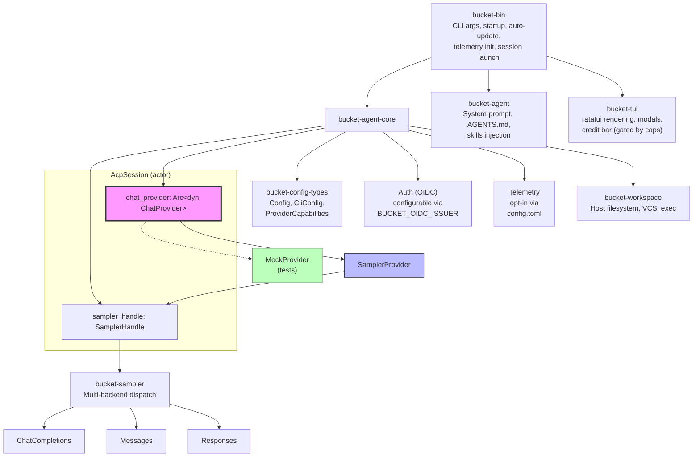

**Key abstraction (highlighted in pink):** The session holds `chat_provider: Arc<dyn ChatProvider>` — all inference flows through this single trait object. The concrete `SamplerProvider` wraps `SamplerHandle` which handles multi-backend dispatch. This is the central seam of the decoupling.

---

## Current Status Summary

| Phase | Name | Status | Completion |
|-------|------|--------|------------|
| 1 | Naming Cleanup | ✅ DONE | 100% |
| 2 | Auth & Billing Decoupling | 🟡 PARTIAL | ~90% |
| 3 | Agent Runtime Decoupling | ✅ DONE | 100% |
| 4 | Project Infrastructure | 🟡 PARTIAL | ~60% |
| 5 | Community Extensibility | 🟢 IN PROGRESS | ~40% |

**Key metrics (verified 2026-07-18):**
- Crates in workspace: ~75
- `.rs` files with `xai`, `x.ai`, `superbucket` references: **0**
- Phase 3 completion commit: `8c7c1af`

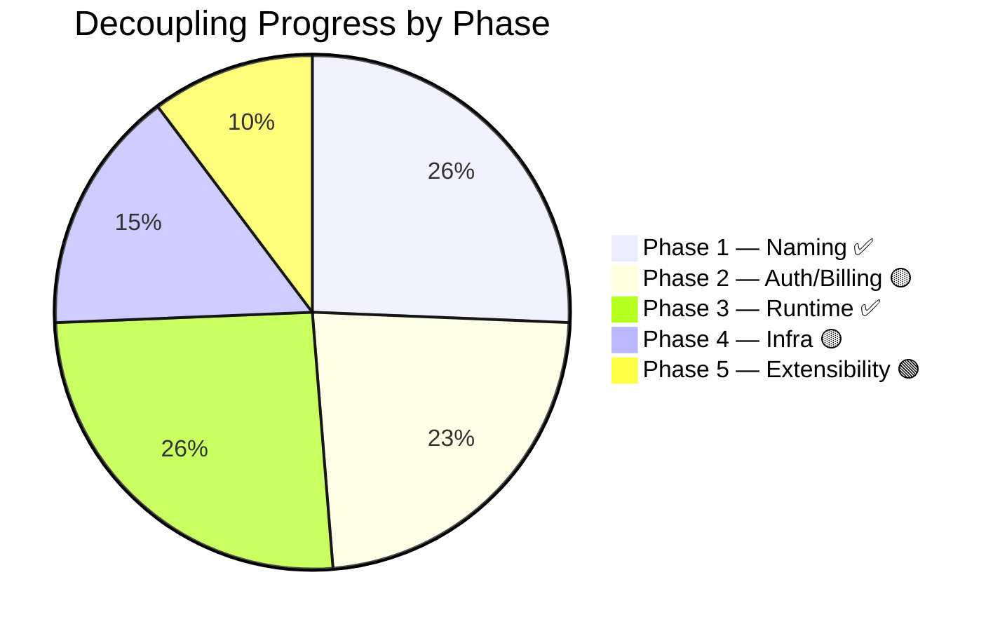

---

## Phase 1 — Naming Cleanup ✅ DONE

**Goal:** No internal names reference `xai` or `xai` except network protocol (model names, endpoints).

### What was done

All crates already follow the `bucket-*` convention. Verified with:

```bash
$ rg -c "x\.ai|xAI|x\.ai" -g '*.rs'
0

$ rg -c "superbucket|SuperBucket|super_bucket" -g '*.rs'
0
```

### Crate structure

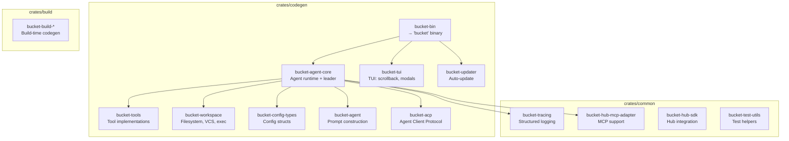

### Env vars (standardized)

All use `BUCKET_*` prefix. Legacy aliases kept for 2+ releases:

| Variable | Purpose |
|----------|---------|
| `BUCKET_HOME` | Config directory root |
| `BUCKET_LOG_FILE` | Log file path |
| `BUCKET_AUTH_PROVIDER_COMMAND` | Custom auth provider |
| `BUCKET_OIDC_ISSUER` | OIDC issuer URL (replaces hardcoded `auth.x.ai`) |
| `BUCKET_API_KEY` | API key (backward compat alias) |
| `BUCKET_LOCAL_AUTH` | Use local accounts-app (`1` = on) |
| `BUCKET_TELEMETRY_ENDPOINT` | OTLP endpoint (empty = off) |

### Config paths

Unified under `~/.bucket/`:

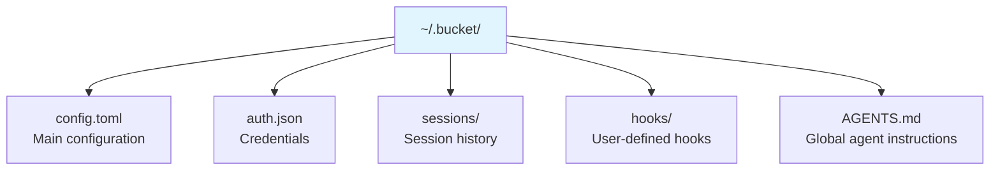

---

## Phase 2 — Auth & Billing Decoupling 🟡 ~90%

**Goal:** Remove all logic that assumes a xAI/bucket account exists.

### 2.1 Login Screen from bucket.com ✅ DONE

**Before:** OIDC issuer was hardcoded to `auth.x.ai`:

```rust
// OLD — hardcoded in auth/config.rs
const BUCKET_OAUTH2_ISSUER: &str = "https://auth.x.ai";
```

**After:** Configurable via `BUCKET_OIDC_ISSUER` env var:

```rust
// CURRENT — crates/codegen/bucket-agent-core/src/auth/config.rs:132-173
/// Default OAuth2 issuer for production — overridden by `BUCKET_OIDC_ISSUER` env var.
pub const BUCKET_OAUTH2_ISSUER: &str = "https://auth.x.ai";

/// Returns the configured OIDC issuer URL from `BUCKET_OIDC_ISSUER` env var.
/// Returns empty string if not set (no default issuer — provider must be configured explicitly).
pub fn oidc_issuer() -> String {
    std::env::var("BUCKET_OIDC_ISSUER").unwrap_or_default()
}
```

The `oauth2_issuer()` function chains: local auth → `BUCKET_OIDC_ISSUER` → empty:

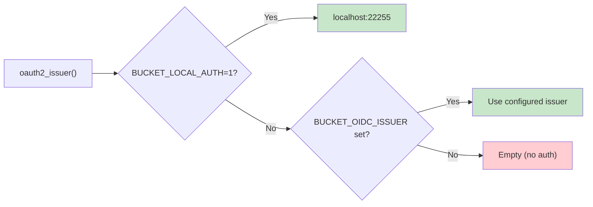

```rust
pub fn oauth2_issuer() -> String {
    if use_local_auth() {
        BUCKET_OAUTH2_LOCAL_ISSUER.to_owned()
    } else {
        oidc_issuer()
    }
}
```

**Commit:** `96ae86b` — `feat: make OIDC issuer configurable via BUCKET_OIDC_ISSUER`

**Remaining work:**
- `PROD_ACCOUNTS_APP_ORIGINS` still hardcoded to `["https://accounts.x.ai"]` (line 138)
- `is_xai_oauth2_issuer()` function name still references "xai" (should be `is_first_party_issuer`)
- `LEGACY_AUTH_SCOPE` const still references `accounts.x.ai` (line 203)

### 2.2 Billing/Subscription Logic ✅ DONE

**Before:** TUI checked billing state directly, showed credit bars, SuperBucket CTAs unconditionally.

**After:** `ProviderCapabilities` gates everything:

```rust
// crates/codegen/bucket-agent-core/src/provider/capabilities.rs
#[derive(Debug, Clone, Serialize, Deserialize)]
#[serde(default)]
pub struct ProviderCapabilities {
    pub has_billing: bool,           // false for Ollama/custom
    pub has_credit_limit: bool,
    pub has_subscription_gate: bool,
    pub supports_streaming: bool,
    pub supports_image_gen: bool,
    pub supports_video_gen: bool,
    pub max_context_tokens: usize,  // 0 = unknown
}

impl Default for ProviderCapabilities {
    fn default() -> Self {
        Self {
            has_billing: false,           // ← KEY: billing OFF by default
            has_credit_limit: false,
            has_subscription_gate: false,
            supports_streaming: true,
            supports_image_gen: true,
            supports_video_gen: true,
            max_context_tokens: 0,
        }
    }
}

impl ProviderCapabilities {
    pub fn shows_billing_ui(&self) -> bool {
        self.has_billing || self.has_credit_limit || self.has_subscription_gate
    }
}
```

**How the TUI uses it:**

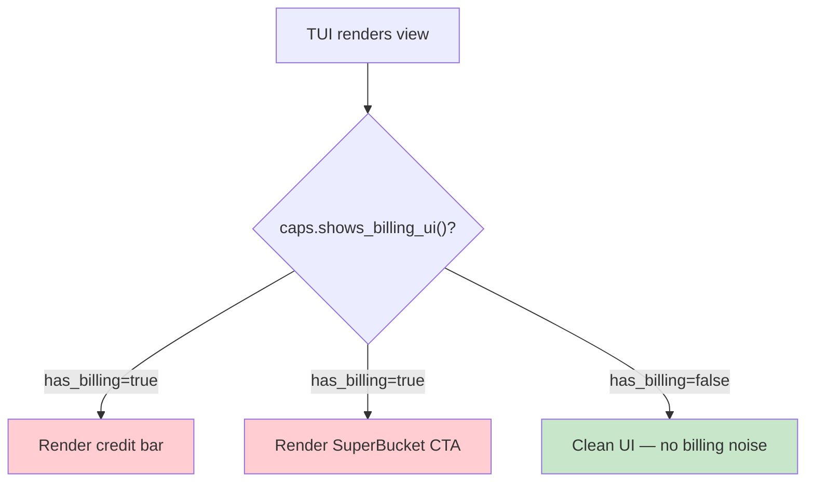

**Commit:** `3db3f80` — `feat: ProviderCapabilities gating + telemetry decoupling`

### 2.3 Update Checker ✅ DONE

**Before:** `bucket-updater` pointed to `https://x.ai/cli/...`.

**After:** URLs configurable via `CliConfig`:

```toml
# ~/.bucket/config.toml
[cli]
auto_update = true
update_check_url = "https://api.github.com/repos/your-org/bucket-agent/releases/latest"
```

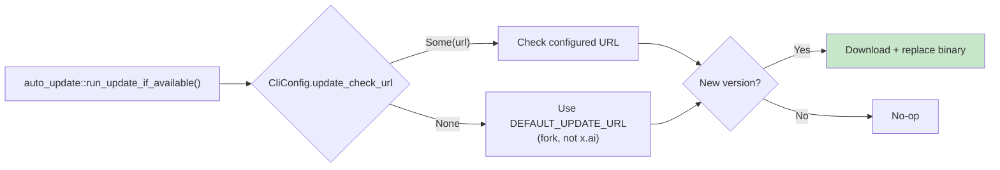

**Commit:** `a8a45fa` — `feat(updater): make update URLs configurable via CliConfig`

### 2.4 Telemetry ✅ DONE

**Before:** OTLP telemetry sent data to xAI infrastructure unconditionally.

**After:** Opt-in via config:

```toml
# ~/.bucket/config.toml
[telemetry]
enabled = false           # off by default
mode = "off"              # "off" | "session-metrics" | "full"
```

Config fields in `bucket-config-types`:

```rust
// crates/codegen/bucket-config-types/src/lib.rs:467-479
pub external_otel_disabled: Option<bool>,
pub telemetry_enabled: Option<bool>,
/// "session-metrics" | "full" | "off"
pub telemetry_mode: Option<String>,
pub trace_upload_enabled: Option<bool>,
```

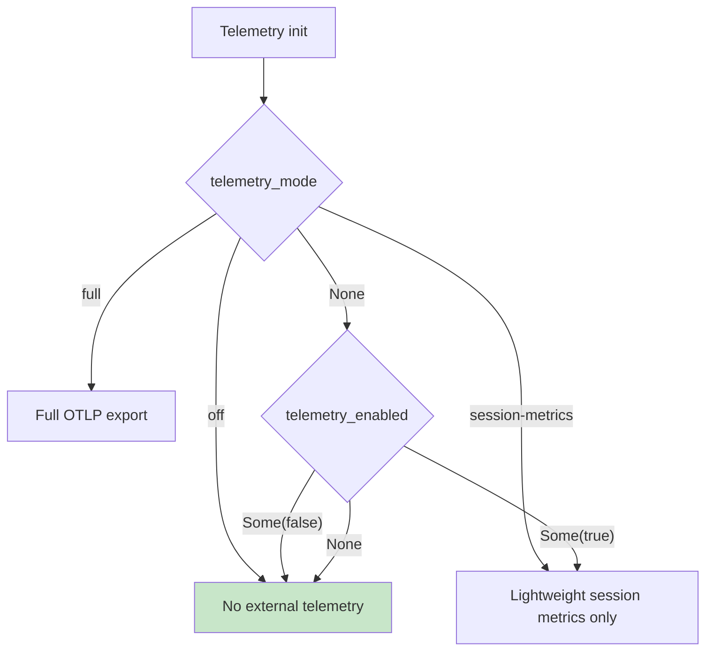

**Internal structured logging** (`unified_log`) is kept — it's useful for debugging.
**External OTLP** only activates if the user configures an endpoint.

### Remaining Phase 2 Work

| # | Task | File/Location |
|---|------|---------------|
| 1 | Rename `require_xai_auth` → `require_first_party_auth` | Deprecated alias exists, callers still use old name |
| 2 | Soften `PROD_ACCOUNTS_APP_ORIGINS` hardcoding | Currently fixed to `["https://accounts.x.ai"]` |
| 3 | Rename `is_xai_oauth2_issuer()` → `is_first_party_issuer()` | Function name still references "xai" |
| 4 | Make SuperBucket tier strings configurable or remove | Hardcoded tier references |

---

## Phase 3 — Agent Runtime Decoupling ✅ 100%

**Goal:** `bucket-agent-core` knows nothing about proprietary infrastructure and assumes no specific backend.

This is the most architecturally significant phase. It introduced the `ChatProvider` trait as the central abstraction for all inference.

### 3.1 The ChatProvider Trait

```rust
// crates/codegen/bucket-agent-core/src/provider/mod.rs
#[async_trait]
pub trait ChatProvider: Send + Sync {
    /// Submit a conversation request and await the complete response.
    /// Streaming events still flow through the shared SamplingEvent
    /// channel for live UI updates.
    async fn complete(
        &self,
        request: ConversationRequest,
    ) -> Result<(ConversationResponse, InferenceLatencyStats), SamplingError>;

    /// Get the current provider capabilities.
    fn capabilities(&self) -> ProviderCapabilities;

    /// Get the current model ID.
    fn model_id(&self) -> &str;

    /// Update the provider configuration (model switch, auth refresh).
    fn update_config(&self, config: SamplerConfig);

    /// Cancel an in-flight request.
    fn cancel(&self, request_id: RequestId);
}
```

**Design rationale:** The trait wraps `SamplerHandle` which already handles multi-backend dispatch (`ApiBackend`: ChatCompletions, Messages, Responses). Future implementations could provide entirely different backends (local model runner, gRPC provider, etc.).

### 3.2 Implementations

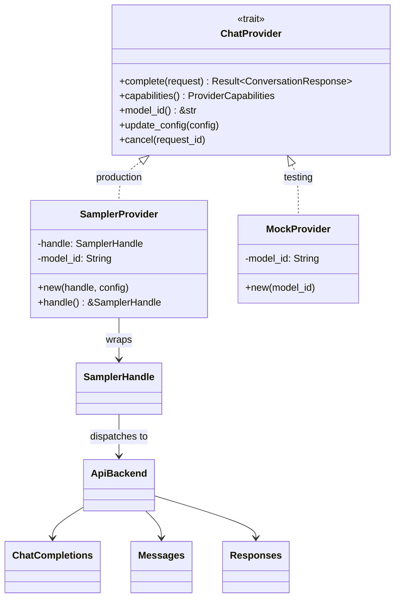

```rust
// crates/codegen/bucket-agent-core/src/provider/mod.rs:52-97
pub struct SamplerProvider {
    handle: SamplerHandle,
    model_id: String,
}

impl SamplerProvider {
    pub fn new(handle: SamplerHandle, config: SamplerConfig) -> Self {
        Self {
            handle,
            model_id: config.model.clone(),
        }
    }
}

#[async_trait]
impl ChatProvider for SamplerProvider {
    async fn complete(
        &self,
        request: ConversationRequest,
    ) -> Result<(ConversationResponse, InferenceLatencyStats), SamplingError> {
        let request_id = RequestId::random();
        self.handle.submit_and_collect(request_id, request).await
    }

    fn capabilities(&self) -> ProviderCapabilities {
        ProviderCapabilities::default()  // no billing, streaming on
    }

    fn model_id(&self) -> &str { &self.model_id }

    fn update_config(&self, config: SamplerConfig) {
        self.handle.update_config(config);
    }

    fn cancel(&self, request_id: RequestId) {
        self.handle.cancel(request_id);
    }
}
```

### 3.3 MockProvider — For Testing

```rust
// crates/codegen/bucket-agent-core/src/provider/mod.rs:104-137
#[cfg(test)]
pub struct MockProvider {
    model_id: String,
}

#[async_trait]
impl ChatProvider for MockProvider {
    async fn complete(
        &self,
        _request: ConversationRequest,
    ) -> Result<(ConversationResponse, InferenceLatencyStats), SamplingError> {
        Err(SamplingError::Auth("mock provider not implemented".into()))
    }

    fn capabilities(&self) -> ProviderCapabilities {
        ProviderCapabilities::default()
    }

    fn model_id(&self) -> &str { &self.model_id }
    fn update_config(&self, _config: SamplerConfig) {}
    fn cancel(&self, _request_id: RequestId) {}
}
```

### 3.4 AcpSession Integration

The session holds a trait object — the critical wiring point:

```rust
// crates/codegen/bucket-agent-core/src/session/acp_session.rs:1015-1016
pub(crate) sampler_handle: bucket_sampler::SamplerHandle,
pub(crate) chat_provider: Arc<dyn crate::provider::ChatProvider>,
```

**How it's wired at spawn time:**

```rust
// crates/codegen/bucket-agent-core/src/session/acp_session_impl/spawn.rs:1328-1332
sampler_handle: sampler_handle.clone(),
chat_provider: Arc::new(crate::provider::SamplerProvider::new(
    sampler_handle,
    bucket_sampler::SamplerConfig::default(),
)),
```

**Inference flow:**

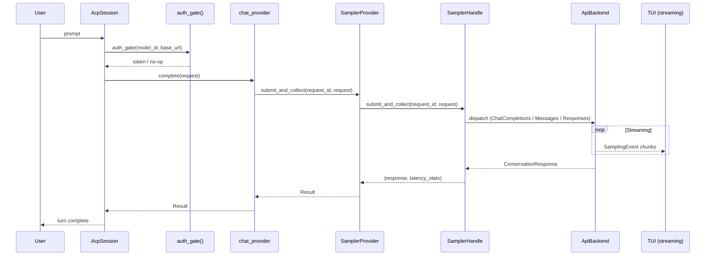

### 3.5 Model System

**Before:** Hardcoded proprietary model catalog in `default_models.json`.

**After:** Neutral config-based resolution:

```toml
# ~/.bucket/config.toml
[models]
default = "ollama-coder"

[model.ollama-coder]
provider    = "ollama"
model       = "qwen2.5-coder:32b"
base_url    = "http://localhost:11434"
api_backend = "ChatCompletions"

[model.gpt-4o]
provider    = "openai"
model       = "gpt-4o"
api_backend = "ChatCompletions"
# uses OPENAI_API_KEY env var

[model.claude-sonnet]
provider    = "anthropic"
model       = "claude-sonnet-4-20250514"
api_backend = "Messages"
# uses ANTHROPIC_API_KEY env var
```

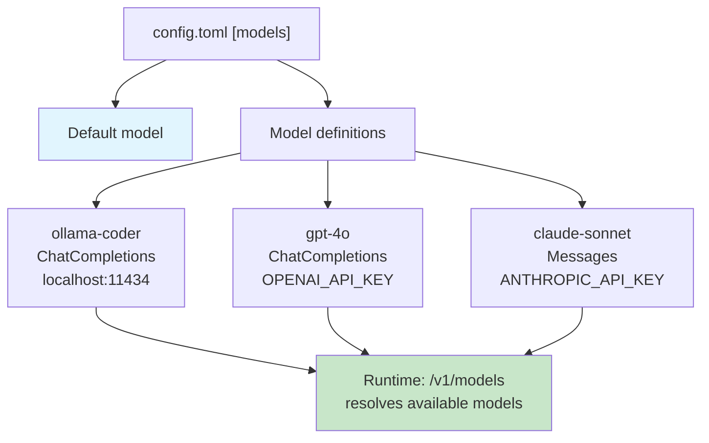

The agent resolves available models at runtime via `/v1/models` endpoint.

### 3.6 System Prompts

Configurable identity — no more hardcoded xAI persona:

```rust
// crates/codegen/bucket-agent/src/prompt/context.rs:149-156
/// Identity in the primary system prompt (`You are <label>…`).
#[serde(default = "default_system_prompt_label")]
pub system_prompt_label: String,

pub const DEFAULT_SYSTEM_PROMPT_LABEL: &str = "Bucket";
fn default_system_prompt_label() -> String {
    DEFAULT_SYSTEM_PROMPT_LABEL.to_string()
}
```

**Override mechanisms (3 ways):**

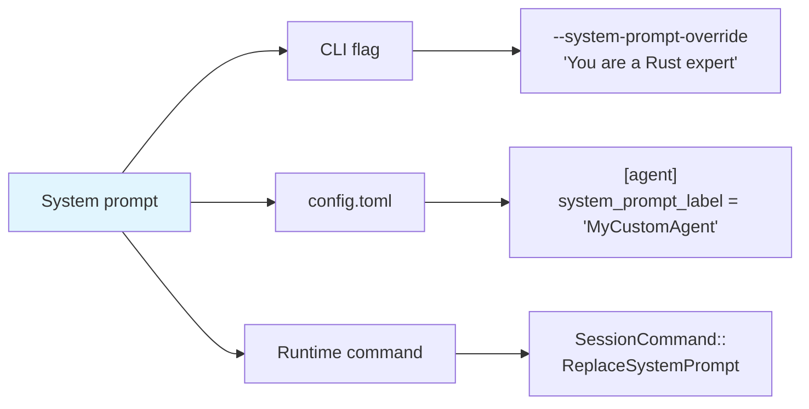

### 3.7 Session Serialization

Provider-agnostic metadata — sessions record `model_id` and `base_url`, not provider-specific tokens:

```rust
// crates/codegen/bucket-agent-core/src/session/persistence.rs:29,787-813
pub const CHAT_FORMAT_VERSION: u8 = 1;

pub struct Summary {
    pub info: Info,
    pub session_summary: String,
    pub created_at: DateTime<Utc>,
    pub updated_at: DateTime<Utc>,
    pub num_messages: usize,
    pub current_model_id: acp::ModelId,        // ← generic model ID
    pub chat_format_version: u8,                // ← 1 = ConversationItem format
    // ... fork metadata, telemetry IDs, etc.
}
```

---

## Phase 4 — Project Infrastructure 🟡 ~60%

**Goal:** Project lives and maintains itself without xAI dependency.

### 4.1 CI/CD ✅ DONE

Three GitHub Actions workflows:

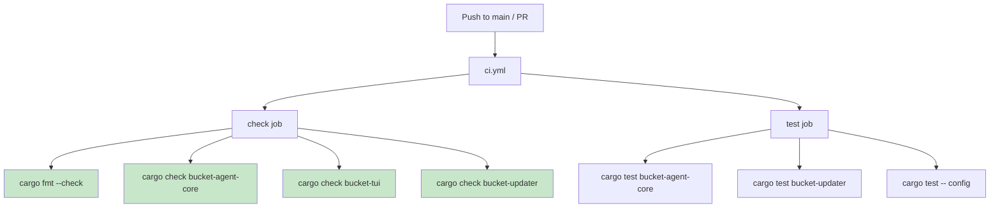

```yaml
# .github/workflows/ci.yml
name: CI
on:
  push:
    branches: [main]
  pull_request:
    branches: [main]

jobs:
  check:
    runs-on: ubuntu-latest
    steps:
      - uses: actions/checkout@v4
      - uses: dtolnay/rust-toolchain@stable
        with:
          toolchain: "1.92.0"
          components: clippy, rustfmt
      - uses: Swatinem/rust-cache@v2
      - name: Install protobuf compiler
        run: sudo apt-get update && sudo apt-get install -y protobuf-compiler
      - name: Install DotSlash
        run: cargo install dotslash
      - name: Check formatting
        run: cargo fmt --all -- --check
      - name: Check bucket-agent-core
        run: cargo check -p bucket-agent-core
      - name: Check bucket-tui
        run: cargo check -p bucket-tui
      - name: Check bucket-updater
        run: cargo check -p bucket-updater

  test:
    needs: check
    steps:
      - run: cargo test -p bucket-agent-core
      - run: cargo test -p bucket-updater
      - run: cargo test -p bucket-agent-core -- config
```

### 4.2 Release Pipeline ✅ DONE

Multi-platform releases via GitHub Actions:

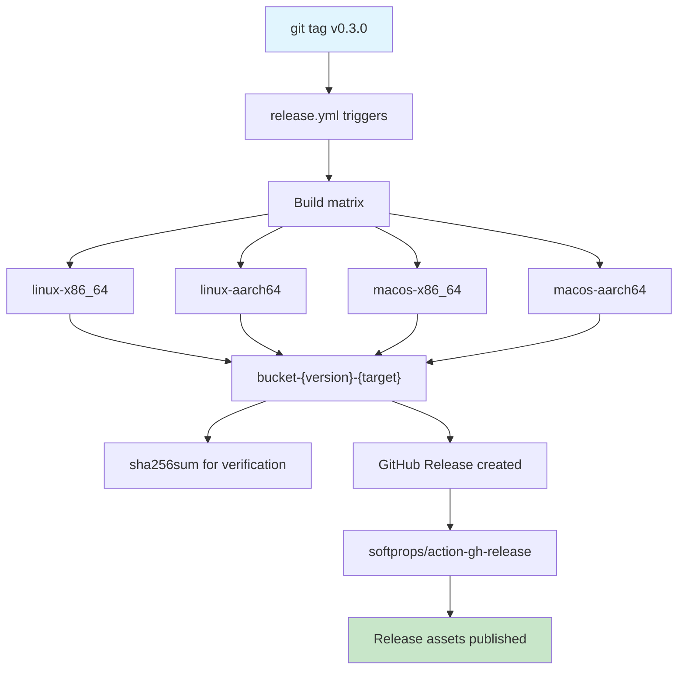

```yaml
# .github/workflows/release.yml (summarized)
on:
  push:
    tags: ["v*"]

jobs:
  build:
    strategy:
      matrix:
        include:
          - target: linux-x86_64
            rust_target: x86_64-unknown-linux-gnu
          - target: linux-aarch64
            rust_target: aarch64-unknown-linux-gnu
          - target: macos-x86_64
            rust_target: x86_64-apple-darwin
          - target: macos-aarch64
            rust_target: aarch64-apple-darwin
    steps:
      - cargo build -p bucket-bin --release --target ${{ matrix.rust_target }}

  release:
    needs: build
    steps:
      - uses: softprops/action-gh-release@v2
        with:
          files: artifacts/*
          generate_release_notes: true
```

### 4.3 Technical Documentation ❌ NOT DONE

| Doc | Purpose | Status |
|-----|---------|--------|
| `ARCHITECTURE.md` | Crate map, responsibilities, data flow | Missing |
| `PROVIDERS.md` | How to add a new ChatProvider implementation | Missing |
| `HACKING.md` | 5-minute dev env setup | Missing |
| `UPSTREAM_DIFF.md` | What changed vs xAI upstream, for cherry-pick | Missing |

### 4.4 Rust Toolchain ✅ DONE

```toml
# rust-toolchain.toml
[toolchain]
channel = "1.92.0"   # edition 2024
```

Bump every 4-6 weeks to avoid deuda tecnica.

---

## Phase 5 — Community Extensibility 🟢 IN PROGRESS

**Goal:** Any contributor can add providers and tools without touching core.

### 5.1 Plugin API for Providers 🟡 PARTIAL

The `ChatProvider` trait exists and works internally. To make it a public API:

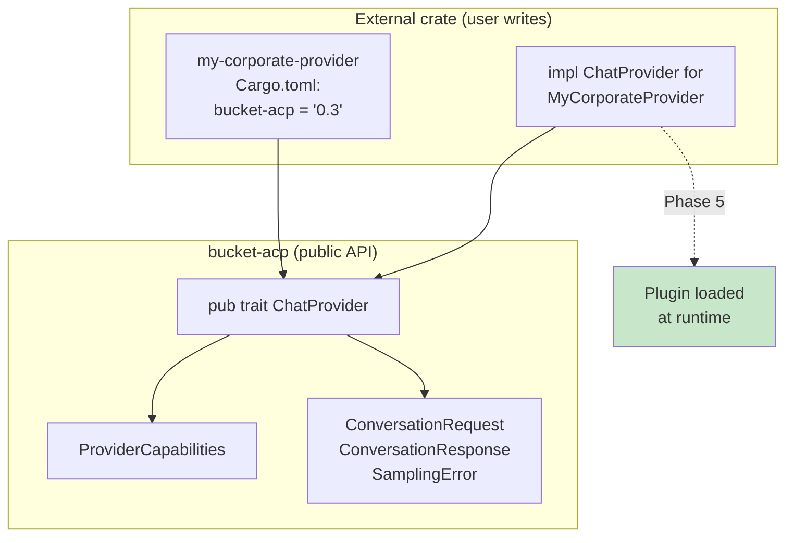

```rust
// FUTURE: crates/codegen/bucket-acp/src/lib.rs
// Expose ChatProvider as stable public trait for external crates:

/// ```toml
/// # Cargo.toml of an external crate
/// [dependencies]
/// bucket-acp = "0.3"
/// ```
///
/// ```rust
/// use bucket_acp::ChatProvider;
///
/// struct MyCorporateProvider { /* ... */ }
///
/// #[async_trait]
/// impl ChatProvider for MyCorporateProvider {
///     async fn complete(&self, request: ConversationRequest)
///         -> Result<(ConversationResponse, InferenceLatencyStats), SamplingError>
///     {
///         // Call your corporate API
///     }
///     fn capabilities(&self) -> ProviderCapabilities { /* ... */ }
///     fn model_id(&self) -> &str { "corporate-llm" }
///     fn update_config(&self, _config: SamplerConfig) {}
///     fn cancel(&self, _request_id: RequestId) {}
/// }
/// ```
```

### 5.2 MCP as Extension Vector ✅ DONE

MCP support via `bucket-hub-mcp-adapter`. Configuration:

```toml
# ~/.bucket/config.toml
[[mcp.server]]
name    = "github"
command = "npx -y @modelcontextprotocol/server-github"

[[mcp.server]]
name    = "postgres"
command = "npx -y @modelcontextprotocol/server-postgres postgresql://localhost/mydb"
```

### 5.3 Skills as First-Class Citizen ✅ DONE

The `SKILL.md` system works. Example skill structure:

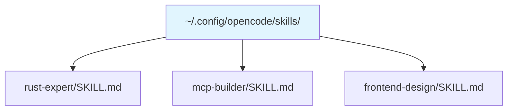

**Future:** Public registry at `bucket-agent/skills` GitHub repo.

---

## Dependency Removal Map

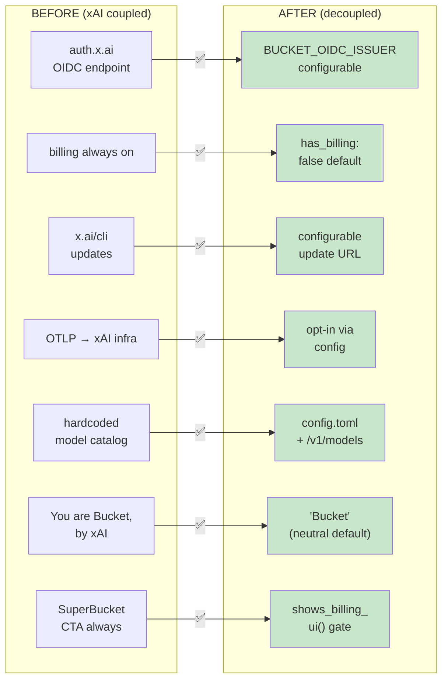

| Dependency | Before | After | Status |
|------------|--------|-------|--------|
| auth.x.ai (OIDC) | Hardcoded | `BUCKET_OIDC_ISSUER` configurable | ✅ |
| bucket.com (login) | Required | Generic OIDC or none | ✅ |
| x.ai/cli (updates) | Hardcoded URL | Configurable `update_check_url` | ✅ |
| OTLP → xAI infra | Unconditional | `BUCKET_TELEMETRY_ENDPOINT` or off | ✅ |
| Crate names | Mixed | All `bucket-*` | ✅ |
| Env vars | Mixed | All `BUCKET_*` + deprecated aliases | ✅ |
| Config dir | `~/.bucket/` | `~/.bucket/` with auto-migration | ✅ |
| Model catalog | Hardcoded JSON | `config.toml` + `/v1/models` | ✅ |
| Billing UI | Always shown | `ProviderCapabilities.has_billing` | ✅ |
| System prompt | xAI references | Configurable, neutral default | ✅ |

---

## Priority Order for Team

| Sprint | Owner | Task | Est. |
|--------|-------|------|------|
| 1 | Agent + 1 | Phase 1 (done — was automatable) | — |
| 2-3 | 2 people | Phase 2: remaining auth cleanup | 2 wks |
| 4-6 | 3 people | Phase 3 (done — ChatProvider) | — |
| 7 | 1 person | Phase 4: docs (ARCHITECTURE, PROVIDERS, HACKING) | 2 wks |
| 8 | 1 person | Phase 5: expose ChatProvider as public API | 1 wk |
| ongoing | all | Community, skills registry, upstream sync | — |

---

## What NOT to Touch (v1)

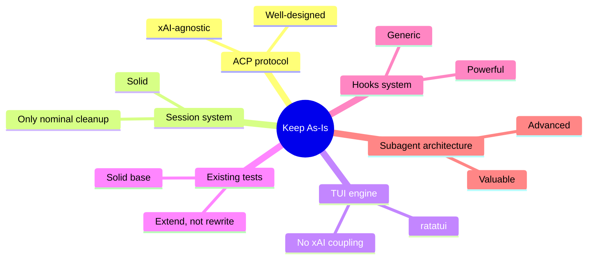

---

## Risk: Upstream Divergence

xAI may release major source updates (happened several times in 2025). Each new upstream release can diverge from the fork in areas already modified.

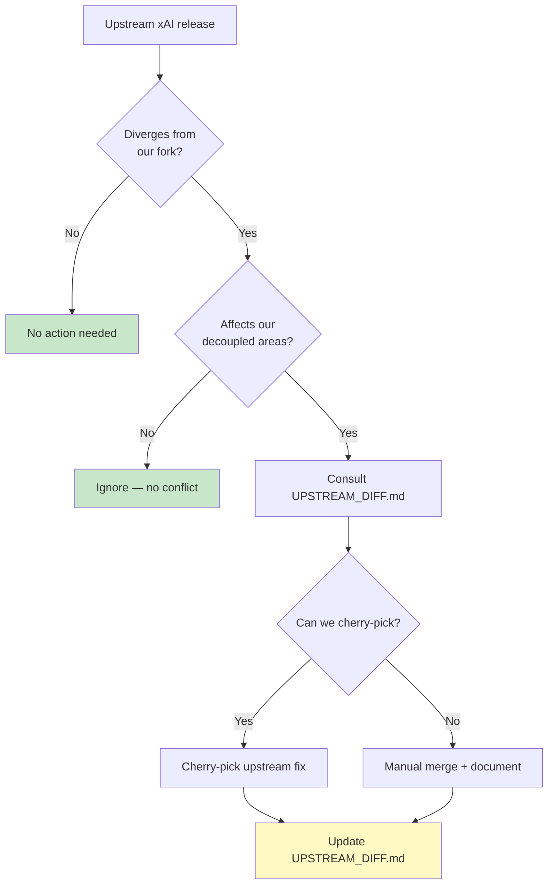

**Mitigation:**

1. Maintain `UPSTREAM_DIFF.md` — documents exactly what changed and why
2. Rotate "upstream sync" duty monthly
3. Keep diffs minimal and well-documented for cherry-pick

---

## Commit Reference Log

| Commit | Phase | Description |
|--------|-------|-------------|
| `d905a29` | 4 | fix(release): update release script readiness check |
| `e229cdb` | 4 | docs(release): prepare v0.1.0 release docs, workflows, installer |
| `efa6cbf` | 2 | fix(auth): restore missing brace in acp_agent match block |
| `3c3848d` | 2 | fix(auth): handle LOCAL_METHOD_ID in ACP agent authenticate handler |
| `8c7c1af` | **3** | **feat(decoupling): complete Phase 3 agent runtime decoupling** |
| `4bd3b22` | 4 | chore: update Cargo.lock for version 0.1.0 |
| `678065b` | 4 | chore: set version to 0.1.0 for initial fork release |
| `bf120a3` | 2,4 | feat: prepare release infrastructure and retarget auto-updater |
| `a8a45fa` | **2.3** | **feat(updater): make update URLs configurable** |
| `96ae86b` | **2.1** | **feat: make OIDC issuer configurable via BUCKET_OIDC_ISSUER** |
| `3db3f80` | **2** | **feat: ProviderCapabilities gating + telemetry decoupling** |
| `36ec730` | 1 | tool: Add generate_workspace.py script and sort workspace members |
